<picture>
  <source media="(prefers-color-scheme: dark)" srcset="./assets/header-dark.svg">
  <source media="(prefers-color-scheme: light)" srcset="./assets/header-light.svg">
  
</picture>

<!-- ...your About Me and badge sections from before go here... -->

### 📊 Languages

<picture>
  <source media="(prefers-color-scheme: dark)" srcset="./profile/top-langs-dark.svg">
  <source media="(prefers-color-scheme: light)" srcset="./profile/top-langs-light.svg">
  
</picture>
